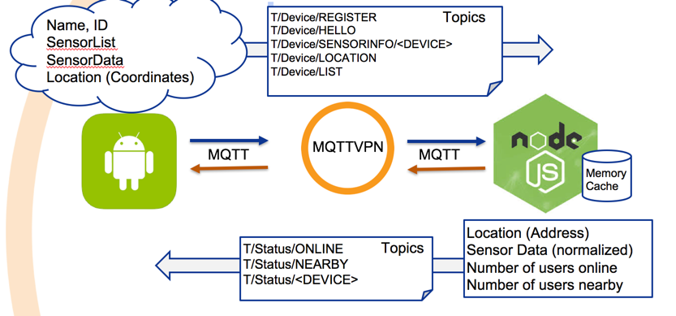
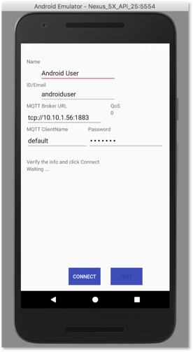
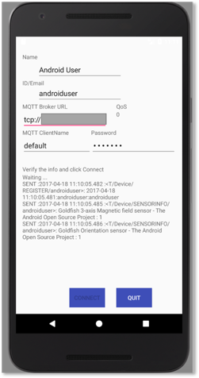
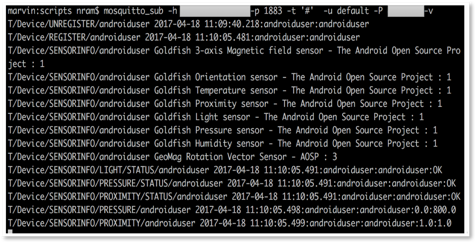
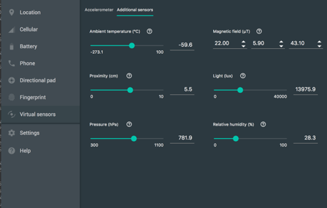

# Android Sensor Solace Client

## About
A simple Android Client that connects to Solace Router and publishes some sensor data. The focus of 
this Client is to demonstrate sensor data gathering and communication to Solace router using MQTT.

The client first collects the list of sensor hardware avilable on the phone (Eg: Light sensor, 
pressure sensor,proximity sensor, GPS) and publishes this data on a predefined topic to Solace 
router. After this, when values change on certain sensors, the changed values are published 
on predefined topic to Solace router. 

The client also receives for any responses from the Solace router. For this to work, a backend
server should be publishing on the response topics. This, however is not a requirement and
the sensor client would work without the server.


## Functional Overview
To following components are required to test this client:

1. An Android hardware or an emulator
1. A Solace router (Solace VMR or Appliance)
1. Optionally, a Solace messaging client that listens to published data for verification 
1. Optionally, a backend server that listens and responds to sensor data




### **Get Started**

If required, either copy your local.properties file or create one with:
```
echo "sdk.dir=<ANDROID_SDK_LIBRARY_PATH>" >> local.properties
```

Pull the source and compile:
```
git clone https://github.com/rnatara/AndroidSimpleSensorClient
cd AndroidSimpleSensorClient
./gradlew assemble
```

If everything goes well, you will see the following APKs
```
./AndroidSimpleSensorClient/build/outputs/apk/AndroidSimpleSensorClient-debug.apk
./AndroidSimpleSensorClient/build/outputs/apk/AndroidSimpleSensorClient-release-unsigned.apk
```
To install, you can mail AndroidSimpleSensorClient-debug.apk to your email address, 
download to your phone and install it. 

*Note:*: You will need to enable "Install from Unknown source" on your phone for this to work.

## Testing
The following steps can be used to verify the Client connectivity to Solace router. Note that
the (optional) backend server setup is not discussed here.

1. Run a subscriber to gather whats being published from the client

This can be done using any tool such as sdkperf. Here Iam using standard Mosquitto client to 
subscribe to all the messages 

```
$ mosquitto_sub -h <solace-router-IP>  -p <mqtt-port> -t '#'  -u default -P <password> –v
```

2. Run the Android Sensor Client.

The application can be deployed on any Android hardware. Here Iam running it on an Android
Emulator from Android Studio.



3.	Enter the Solace VMR/Appliance message interface IP, port, MQTT username, 
password and Connect.  For this demo, Iam using a Solace VMR hosted on Amazon AWS



4.	The Android client makes a connection to Solace VMR/Appliance and sends its list of 
sensors on predefined topic. The subscriber receives the data and dumps on the screen.


5.	Change some sensor values. If you are using it on a phone move the phone near or away 
from light source to trigger light sensor data. Or you can move your hand close to screen 
to trigger proximity sensor data. Below, on the Android simulator, I changed some sensor 
values using Virtual Sensor Control panel:



6.	You will notice the subscriber receives these via Solace router and dumps the values 
on the screen.


## References
Here are some links you will find interesting:
* [The Solace Developer Portal](http://dev.solace.com/)
* [Android Development](https://developer.android.com/training/index.html)
* [Getting started with Android development](http://www.vogella.com/tutorials/Android/article.html)
* [Android Tutorial](https://www.tutorialspoint.com/android/)
* [Using MQTT in Android mobile applications](http://dalelane.co.uk/blog/?p=1599) 