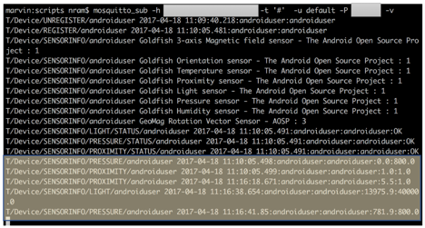

# Android Sensor Solace Client

A simple Android Client that connects to Solace Router via MQTT and publish some sensor data.

## Testing
1. Run a subscriber to gather whats being published from the client

This can be done using any tool such as sdkperf. Here Iam using standard Mosquitto client to 
subscribe to all the messages 

`$ mosquitto_sub -h <solace-router-IP>  -p <mqtt-port> -t '#'  -u default -P <password> –v`

2. Run the Android Sensor Client.

The application can be deployed on any Android hardware. Here Iam running it on an Android
Emulator from Android Studio.

3.	Enter the Solace VMR/Appliance message interface IP, port, MQTT username, 
password and Connect.  For this demo, Iam using a Solace VMR hosted on Amazon AWS

4.	The Android client makes a connection to Solace VMR/Appliance and sends its list of 
sensors on predefined topic. The subscriber receives the data and dumps on the screen.

5.	Change some sensor values. If you are using it on a phone move the phone near or away 
from light source to trigger light sensor data. Or you can move your hand close to screen 
to trigger proximity sensor data. Below, on the Android simulator, I changed some sensor 
values using Virtual Sensor Control panel:

6.	You will notice the subscriber receives these via Solace router and dumps the values 
on the screen.

